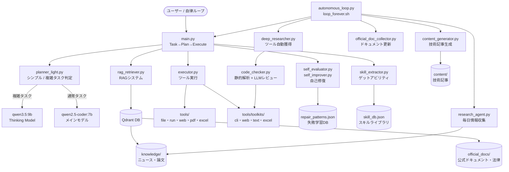

# 🤖 自律AIエージェント

> ローカルLLM（Ollama）で動作する自己改善型AIエージェント。
> 失敗から学習し、新しいスキルを獲得し、技術記事を自動生成する — 完全自律。


---

## ✨ 主な機能

| 機能 | 説明 |
|------|------|
| 🔧 **自己修復** | 失敗をパターン分類し、LLMで自動修正 |
| ⚡ **スキル学習** | 成功タスクから再利用可能なスキルを抽出（ゲットアビリティ） |
| 📚 **RAG** | Qdrant + BGE-M3で蓄積知識を検索・注入 |
| 🔍 **自律研究** | ニュース・論文・公式ドキュメントを毎日自動収集 |
| 🛡️ **コード品質** | 静的解析 + LLMレビューでバグを検出・修正 |
| 📝 **記事生成** | RAGを使って技術記事を自動生成 |

---

## 🏗️ アーキテクチャ



---

## 🧠 仕組み

### Task → Plan → Execute ループ

```
タスク受信
  ↓
RAG検索（関連知識をプロンプトに注入）
  ↓
プランナー（シンプル→通常モデル / 複雑→Thinkingモデル）
  ↓
ツール実行（最大30ステップ）
  ↓
成功 → スキル保存（skill_db.json）
失敗 → 自己修復（repair_patterns.json）
```

### ゲットアビリティ（スキル学習）

成功したタスクから「実行パターン」を自動抽出して保存。
次回の類似タスクでヒントとして注入されるため、初手から最適なアプローチをとれる。

```
成功タスク
  ↓
tools_used（実行順序）+ key_imports（使用ライブラリ）を抽出
  ↓
skill_db.json に保存（success_countで優先度管理）
  ↓
次回タスク時にプランナーへ [SKILL HINT] として注入
```

### RAGシステム

2つのコレクションで構成：

| コレクション | 内容 | trust | 更新 |
|------|------|------|------|
| knowledge | ニュース・論文・技術情報 | 0.75 | 毎日 |
| official_docs | 公式ドキュメント・法律・規格 | 0.9 | バージョン変化時 |

スコア計算: `raw_score × trust × freshness`（knowledgeのみ freshness補正あり）

---

## 📁 ファイル構成

```
agent/
├── main.py                    # メインループ（Task→Plan→Execute）
├── executor.py                # ツール実行エンジン
├── llm.py                     # LLM呼び出し（通常/Thinking/レビュー）
├── planner_light.py           # タスク複雑度判定・プランニング
├── parser.py                  # JSON修復パーサー
│
├── self_evaluator.py          # 失敗分類（11種類）
├── self_improver.py           # 自己修復
├── code_repair.py             # コード自動修正
├── pattern_repair.py          # 修復パターン検索
│
├── skill_extractor.py         # スキル抽出・保存・検索
├── toolkit_manager.py         # ツールのカテゴリ別統合管理
├── deep_researcher.py         # ライブラリ自動発見・実装・登録
├── code_checker.py            # 静的解析 + LLMレビュー
│
├── rag_retriever.py           # RAG検索システム（Qdrant + BGE-M3）
├── research_agent.py          # 毎日情報収集エージェント
├── official_doc_collector.py  # 公式ドキュメント自動収集
├── collection_log.py          # 収集ログ管理
├── seen_urls.py               # 既読URL管理（重複防止）
│
├── content_generator.py       # 技術記事自動生成
├── monetization_runner.py     # 記事生成ランナー
├── user_request_handler.py    # オンデマンドツール生成
├── autonomous_loop.py         # 自律ループ制御
│
├── tools/
│   ├── web_search.py          # Web検索ツール群
│   ├── filesystem.py          # サンドボックスファイル操作
│   ├── toolkits/
│   │   ├── cli_toolkit.py     # CLI・コマンド処理
│   │   ├── web_toolkit.py     # HTTP・スクレイピング
│   │   ├── text_toolkit.py    # テキスト処理
│   │   └── excel_toolkit.py   # Excel操作
│   └── evolved/               # 自動獲得ツール（6個）
│
├── testcases/
│   ├── coding_tests.json
│   ├── file_tests.json
│   ├── pdf_tests.json
│   ├── excel_tests.json
│   ├── web_tests.json
│   ├── complex_tests.json
│   └── hard_tests.json
│
├── memory/
│   ├── skill_db.json          # 習得スキル（22個）
│   ├── repair_patterns.json   # 修復パターン
│   ├── content_log.json       # 記事生成ログ
│   ├── official_docs_meta.json
│   ├── seen_urls.json
│   └── qdrant_db/             # ベクトルDB
│
├── knowledge/                 # 収集した知識（Markdown）
├── official_docs/             # 公式ドキュメントキャッシュ
├── content/                   # 生成した技術記事
└── logs/                      # 実行ログ
```

---

## 🚀 セットアップ

### 必要な環境

- macOS（Apple Silicon推奨）
- Python 3.10以上
- [Ollama](https://ollama.ai/)

### インストール

```bash
# リポジトリをクローン
git clone https://github.com/Glumgam/agent.git
cd agent

# 仮想環境を作成
python -m venv venv
source venv/bin/activate

# 依存パッケージをインストール
pip install sentence-transformers qdrant-client requests httpx \
    pypdf pdfplumber reportlab openpyxl pandas pillow qrcode rich typer

# Ollamaモデルをインストール
ollama pull qwen2.5-coder:7b
ollama pull qwen3.5:9b
ollama pull bge-m3
```

### 実行

```bash
# 単発タスク
python main.py "FizzBuzzをPythonで実装して"

# 自律ループ起動（永続実行）
bash loop_forever.sh

# テスト実行
python tester.py --rounds 1

# 記事生成
python monetization_runner.py --genre python_tips
```

---

## 🧪 テスト結果

| カテゴリ | 結果 |
|------|------|
| Coding（基本実装） | 3/3 ✅ |
| File Operations | 4/4 ✅ |
| PDF操作 | 4/4 ✅ |
| Excel操作 | 4/4 ✅ |
| Web・API | 3/3 ✅ |
| Complex（複合タスク） | 5/5 ✅ |
| Hard（高難度） | 5/5 ✅ |
| On-demand（自動生成ツール） | 5/5 ✅ |
| **合計** | **33/33 (100%)** |

---

## 🔄 自律ループのフェーズ

| フェーズ | 頻度 | 内容 |
|------|------|------|
| Phase 0 | 8サイクルに1回 | 公式ドキュメント更新チェック |
| Phase 1 | 毎サイクル | 情報収集 + スキル自動獲得 |
| Phase 1.5 | 2サイクルに1回 | スキル応用・発展 |
| Phase 1.7 | 24サイクルに1回 | 技術記事自動生成 |
| Phase 2 | 毎サイクル | テスト実行・品質確認 |

---

## 📊 使用モデル

| 役割 | モデル | 用途 |
|------|------|------|
| メイン実行 | qwen2.5-coder:7b | コード生成・ツール実行 |
| 複雑タスク | qwen3.5:9b | 深い推論が必要な場面のみ |
| Embedding | BAAI/bge-m3 | RAGベクトル検索 |
| コードレビュー | deepseek-coder-v2:lite | バグ検出（フォールバックあり） |

---

## 📄 ライセンス

MIT License
